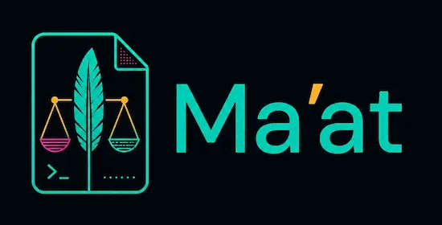

# Ma'at

<p align="center">
  
</p>

<p align="center">
  <strong>Documentation-as-code for humans and AI agents.</strong>
</p>

<p align="center">
  Keep your docs, source code, and AI-agent instructions in sync. Fail CI when they drift.
</p>

<p align="center">
  <a href="https://github.com/getmaat/maat/actions/workflows/maat.yml">
    
  </a>
  <a href="https://github.com/getmaat/maat/releases/latest">
    
  </a>
  <a href="LICENSE">
    
  </a>
</p>

<!--
<p align="center">
  
</p>
-->

---

## Why Ma'at?

Modern repositories have two audiences:

- **Humans** need accurate architecture notes, guides, ADRs, and references.
- **AI coding agents** need setup steps, project rules, conventions, and task context.

But that knowledge usually gets scattered across:

- `docs/`
- `AGENTS.md`
- `CLAUDE.md`
- `.github/copilot-instructions.md`
- `.cursor/rules/...`
- `.windsurf/rules/...`
- `GEMINI.md`
- other agent-specific files

Maintaining all of that by hand guarantees drift.

**Ma'at makes one source of truth explicit, generates the derived files, and checks everything in CI.**

---

## Fast start

Install Ma'at:

```bash
# Homebrew
brew install getmaat/tap/maat

# Install script, no Go toolchain required
curl -sSf https://raw.githubusercontent.com/getmaat/maat/main/scripts/install.sh | sh

# Go
go install github.com/getmaat/maat@latest
```

Scaffold your repository:

```bash
maat init . --name "My Project" --summary "What it does"
```

Validate it:

```bash
maat check
```


That gives your repo a documentation-as-code structure, generated AI-agent adapter files, and a CI gate that treats documentation drift like a failing test.

---

## What Ma'at gives you

| Problem                                                    | Ma'at’s answer                                                                                     |
| ---------------------------------------------------------- | -------------------------------------------------------------------------------------------------- |
| Docs rot after code changes                                | Docs declare the source files they cover via `related_code`; `maat check` detects stale docs.      |
| Every AI agent wants a different instruction file          | Keep `AGENTS.md` canonical; generate agent-specific adapters.                                      |
| New contributors do not know where durable knowledge lives | Scaffold a predictable `docs/` tree with guides, architecture docs, ADRs, references, and indexes. |
| Generated files drift from source                          | `maat sync` regenerates them; `maat check` verifies them.                                          |
| Teams forget to update docs                                | CI fails the pull request, just like a test failure.                                               |

---

## The core workflow

```text
edit code
   ↓
update docs in the same change
   ↓
run maat sync
   ↓
run maat check
   ↓
open PR
   ↓
CI verifies docs, indexes, and agent files are still in sync
```

A change is not complete until its documentation is updated in the same pull request.

---

## What gets scaffolded?

```text
AGENTS.md                        # canonical cross-agent instructions
docs/
  index.md                       # human documentation entry point
  llms.txt                       # machine-readable documentation index
  architecture/
  decisions/
  guides/
  reference/
  meta/
templates/                       # ADR and module templates
.maat.yml                        # Ma'at configuration
.github/workflows/maat.yml       # CI gate

CLAUDE.md
GEMINI.md
.hermes.md
.github/copilot-instructions.md
.cursor/rules/maat.mdc
.windsurf/rules/maat.md          # generated agent adapters
```

`maat init` is safe to re-run. It creates the Ma'at structure without overwriting existing project-owned files.

If your repository already has an `AGENTS.md`, Ma'at preserves your prose and inserts its maintenance contract into a managed block. Your hand-written content remains yours; Ma'at only updates the managed block.

---

## How it works

```text
                         .maat.yml
                              │
                              ▼
   docs/*.md  ──scan──▶  DocsModel  ──┬── generate ──▶ llms.txt, adapters, index
  AGENTS.md                           │
                                      └── validate ──▶ pass/fail, the CI gate
```

- **`docs/` + `AGENTS.md`** are the source of truth — hand-written, reviewed in PRs, and versioned with the code.
- **`docs/llms.txt`**, the per-agent adapter files, and the navigation in `docs/index.md` are generated from that source.
- **`maat check`** verifies front matter, links, `related_code`, staleness, and generated-file drift.
- **CI fails** when docs or generated files fall behind the code.

---

## CLI

A single static binary with zero runtime dependencies.

```bash
maat init .     # scaffold docs/, AGENTS.md, config, CI, templates, and adapters
maat sync       # regenerate llms.txt, adapters, and index navigation
maat check      # validate docs and fail on drift
```

Running from a clone without installing:

```bash
go build -o maat .
go run . <command>
```

| Command | Does                                                                 |
| ------- | -------------------------------------------------------------------- |
| `init`  | Stamps the framework into a repository. Safe to re-run.              |
| `sync`  | Regenerates every derived file from the docs tree and `AGENTS.md`.   |
| `check` | Validates front matter, links, `related_code`, staleness, and drift. |

---

## GitHub Actions

Use Ma'at in CI to block documentation drift on pull requests.

```yaml
name: maat

on:
  pull_request:
  push:
    branches: [main]

jobs:
  maat:
    runs-on: ubuntu-latest
    steps:
      - uses: actions/checkout@v4
      - uses: getmaat/maat@v0.4.0
        with:
          version: "0.4.0"
```

Make this job required if you want documentation drift to block merges.

---

## Who is this for?

Ma'at is useful if your project:

- uses AI coding agents such as GitHub Copilot, Claude Code, Codex, Cursor, Windsurf, opencode, Hermes, Gemini CLI, or similar tools;
- has docs that should stay versioned with the code;
- wants one canonical source for contributor and agent instructions;
- wants CI to catch stale documentation;
- wants a lightweight convention instead of a hosted docs platform.

Ma'at is **not** a documentation website generator.

It is a repository-local convention and CLI for keeping docs, source code, and AI-agent instructions aligned.

---

## Documentation

This repository dogfoods Ma'at.

- Human entry point: [`docs/index.md`](docs/index.md)
- Agent entry point: [`docs/llms.txt`](docs/llms.txt)
- Design rationale: [`docs/decisions/`](docs/decisions/)
- Adoption guide: [`docs/guides/deployment.md`](docs/guides/deployment.md)
- Contributor protocol: [`AGENTS.md`](AGENTS.md)

---

## The update protocol

A change is not complete until its docs are updated in the same change.

See [`AGENTS.md`](AGENTS.md) for the full protocol every contributor — human or agent — follows.

---

## Contributing

Bug reports, feature requests, and pull requests are welcome.

Before opening a PR:

```bash
go test ./...
go run . sync
go run . check
```

See [`CONTRIBUTING.md`](CONTRIBUTING.md) for development setup.

---

## License

Apache-2.0 — see [`LICENSE`](LICENSE).
